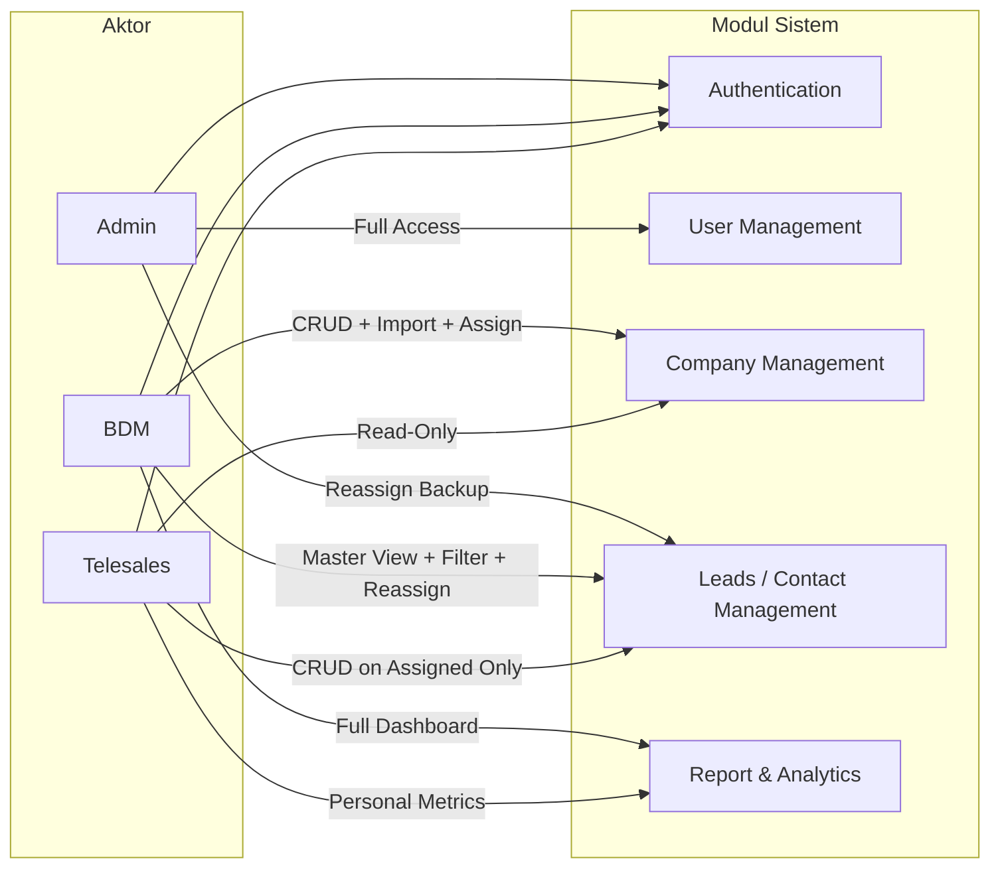
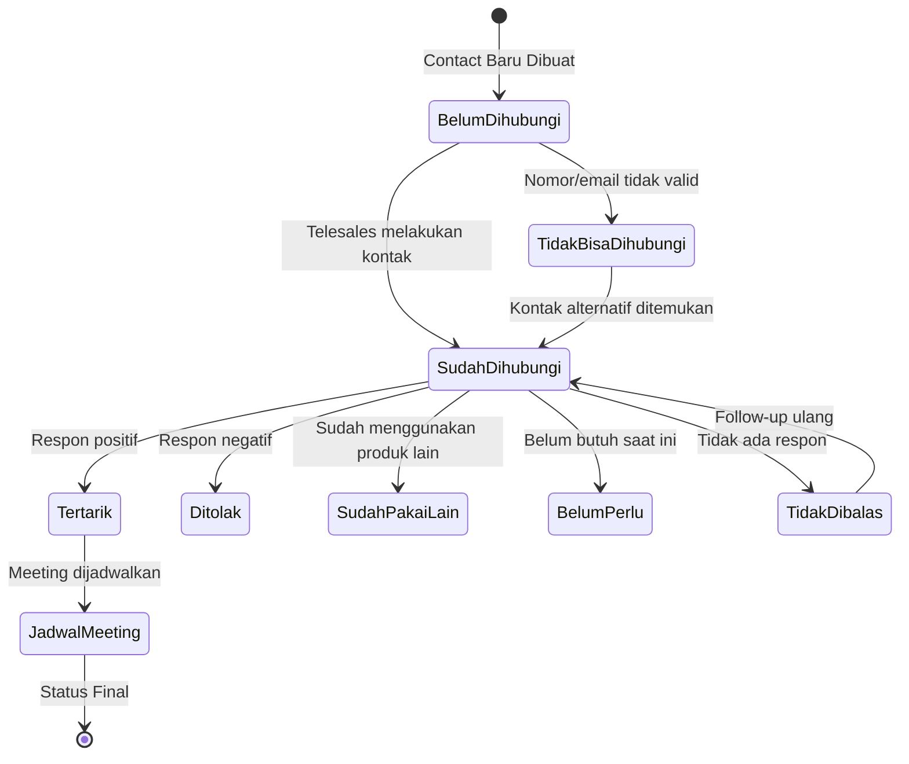

# 3.1 Skenario Use Case — Web CRM Telemarketing

> **Proyek:** Web CRM - Telemarketing · PT Eclectic Consulting  
> **Stack:** Svelte (FE) + Golang (BE) + PostgreSQL (DB)  
> **Metodologi:** Agile — Jira  
> **Versi Dokumen:** 1.0 · 4 Mei 2026

---

## Diagram Konteks Aktor & Modul

---

## Legenda

| Kode Prefix | Modul                      |
| :---------: | -------------------------- |
|   `UC-AU`   | Authentication             |
|   `UC-UM`   | User Management            |
|   `UC-CM`   | Company Management         |
|   `UC-LM`   | Leads / Contact Management |
|   `UC-RA`   | Report & Analytics         |

---

## A. Modul Authentication

| ID Use Case | Nama Skenario Use Case |      Aktor Utama      | Pre-Condition                                           | Main Flow                                                                                                                                                                                                                             | Post-Condition                                                    |
| :---------: | ---------------------- | :-------------------: | ------------------------------------------------------- | ------------------------------------------------------------------------------------------------------------------------------------------------------------------------------------------------------------------------------------- | ----------------------------------------------------------------- |
|  UC-AU-01   | Login ke Sistem        | Admin, BDM, Telesales | Aktor memiliki akun aktif yang telah dibuat oleh Admin. | 1. Aktor membuka halaman login CRM. 2. Aktor memasukkan email dan password. 3. Sistem memvalidasi kredensial dan mengidentifikasi role (Admin / BDM / Telesales). 4. Sistem mengarahkan aktor ke dashboard sesuai hak akses role-nya. | Aktor berhasil masuk dan session aktif tercatat di sistem.        |
|  UC-AU-02   | Logout dari Sistem     | Admin, BDM, Telesales | Aktor sedang dalam keadaan login (session aktif).       | 1. Aktor menekan tombol "Logout". 2. Sistem menghapus/invalidate session token. 3. Sistem mengarahkan aktor kembali ke halaman login.                                                                                                 | Session berakhir; aktor harus login ulang untuk mengakses sistem. |

---

## B. Modul User Management (Aktor: Admin)

| ID Use Case | Nama Skenario Use Case  | Aktor Utama | Pre-Condition                                                      | Main Flow                                                                                                                                                                                                                                       | Post-Condition                                                                               |
| :---------: | ----------------------- | :---------: | ------------------------------------------------------------------ | ----------------------------------------------------------------------------------------------------------------------------------------------------------------------------------------------------------------------------------------------- | -------------------------------------------------------------------------------------------- |
|  UC-UM-01   | Membuat Akun User Baru  |    Admin    | Admin sudah login; halaman User Management terbuka.                | 1. Admin menekan tombol "Tambah User". 2. Admin mengisi form (Nama, Email, Password Default, Role: Telesales/BDM). 3. Sistem memvalidasi email belum terdaftar. 4. Sistem menyimpan data akun baru dengan status **Aktif**.                     | Akun user baru tersedia dan siap digunakan untuk login.                                      |
|  UC-UM-02   | Mengedit Data Akun User |    Admin    | Admin sudah login; data user yang ingin diedit tersedia di daftar. | 1. Admin memilih user dari daftar dan menekan "Edit". 2. Admin mengubah field yang diperlukan (Nama, Email, Role). 3. Admin menekan "Simpan". 4. Sistem memperbarui data user di database.                                                      | Data profil user berhasil diperbarui; perubahan role langsung berlaku pada login berikutnya. |
|  UC-UM-03   | Menonaktifkan Akun User |    Admin    | Admin sudah login; user target berstatus **Aktif**.                | 1. Admin memilih user dan menekan tombol "Nonaktifkan". 2. Sistem menampilkan konfirmasi "Apakah Anda yakin?". 3. Admin mengonfirmasi aksi. 4. Sistem mengubah status akun menjadi **Nonaktif** dan menginvalidasi session aktif user tersebut. | User yang dinonaktifkan tidak dapat login; data historis tetap tersimpan.                    |
|  UC-UM-04   | Reset Password User     |    Admin    | Admin sudah login; user target memiliki akun aktif.                | 1. Admin memilih user dan menekan "Reset Password". 2. Sistem menggenerate password baru / menampilkan field input password baru. 3. Admin mengonfirmasi reset. 4. Sistem menyimpan password baru (hashed) dan menginvalidasi session lama.     | Password user berhasil direset; user harus login ulang dengan password baru.                 |

---

## C. Modul Company Management

| ID       | Nama Skenario                            | Aktor          | Pre-Condition                                                          | Main Flow                                                                                                                                                                                                                        | Post-Condition                                                                                                         |
| -------- | ---------------------------------------- | -------------- | ---------------------------------------------------------------------- | -------------------------------------------------------------------------------------------------------------------------------------------------------------------------------------------------------------------------------- | ---------------------------------------------------------------------------------------------------------------------- |
| UC-CM-01 | Import Data Company (+ Contact Opsional) | BDM            | BDM sudah login; file CSV/Excel disiapkan.                             | 1. Tekan "Import", unggah file. 2. Petakan kolom (Nama Company, Industri, dll. **+ kolom Contact jika ada**). 3. Sistem jalankan **validasi duplikasi** nama company. 4. Tampilkan ringkasan: berhasil, duplikat ditolak, error. | Data company (+ contact jika ada) tersimpan; duplikat dicegah.                                                         |
| UC-CM-02 | Menambah Company Manual                  | BDM            | BDM sudah login.                                                       | 1. Tekan "Tambah Company". 2. Isi form (Nama, Industri, Alamat, Telepon, Website). 3. Sistem cek duplikasi real-time. 4. Jika unik, simpan data.                                                                                 | Company baru tersimpan; status = Unassigned.                                                                           |
| UC-CM-03 | Mengedit Profil Company                  | BDM            | BDM sudah login; company ada di sistem.                                | 1. Pilih company, tekan "Edit". 2. Ubah informasi profil. 3. Validasi perubahan (cek duplikasi jika nama diubah). 4. Simpan.                                                                                                     | Profil company diperbarui.                                                                                             |
| UC-CM-04 | Melihat Daftar & Detail Company          | BDM, Telesales | Aktor sudah login.                                                     | 1. Buka halaman Company Management. 2. Pencarian & filter (nama, industri, PIC). 3. Pilih company untuk detail. 4. Sistem tampilkan profil + label "PIC/Assigned To".                                                            | Aktor melihat detail company. *Telesales: tombol Leads hanya muncul jika di-assign kepadanya (Conditional Rendering).* |
| UC-CM-05 | Assign Company ke Telesales              | BDM            | BDM sudah login; company berstatus Unassigned atau perlu redistribusi. | 1. Multi-select company dari daftar. 2. Tekan "Assign", pilih Telesales tujuan. 3. Sistem update field "Assigned To/PIC". 4. Konfirmasi berhasil.                                                                                | Company di-assign; Telesales dapat akses modul Leads.                                                                  |
| UC-CM-06 | Menghapus Data Company                   | BDM            | BDM sudah login.                                                       | 1. Pilih company, tekan "Hapus". 2. Sistem tampilkan peringatan jika ada contact terikat. 3. BDM konfirmasi. 4. Sistem soft-delete company + child data.                                                                         | Company dihapus dari daftar aktif.                                                                                     |

---

## D. Modul Leads / Contact Management

| ID Use Case  | Nama Skenario Use Case                  |  Aktor Utama   | Pre-Condition                                                                                                                                                 | Main Flow                                                                                                                                                                                                                                                                                                                                                        | Post-Condition                                                                                                                                           |
| :----------: | --------------------------------------- | :------------: | ------------------------------------------------------------------------------------------------------------------------------------------------------------- | ---------------------------------------------------------------------------------------------------------------------------------------------------------------------------------------------------------------------------------------------------------------------------------------------------------------------------------------------------------------- | -------------------------------------------------------------------------------------------------------------------------------------------------------- |
|   UC-LM-01   | Menambah Contact/Lead Baru pada Company |   Telesales    | Telesales sudah login; company sudah di-assign kepada Telesales tersebut.                                                                                     | 1. Telesales membuka detail company yang di-assign kepadanya dan menekan "Tambah Contact". 2. Telesales mengisi data contact (Nama, Jabatan/Decision Maker, No. Telepon, Email, Jenis Contact). 3. Sistem menyimpan contact baru dengan status awal **"Belum Dihubungi"**. 4. Leads baru tampil di daftar contact company tersebut.                              | Contact baru terdaftar di bawah company; status awal = "Belum Dihubungi".                                                                                |
|   UC-LM-02   | Update Status Aksi Contact              |   Telesales    | Telesales sudah login; contact/lead sudah ada dan berstatus  **"Belum Dihubungi"**, **"Tidak Bisa Dihubungi"**, atau **"Tidak Dibalas"** (retry tanpa batas). | 1. Telesales memilih contact dari daftar leads dan menekan "Update Status". 2. Telesales memilih status aksi: **Sudah Dihubungi** / **Tidak Bisa Dihubungi**. 3. Telesales mengisi catatan/riwayat singkat (tanggal, channel: Call/WA/Email, notes). 4. Sistem menyimpan perubahan status dan mencatat riwayat di log aktivitas.                                 | Status aksi contact berhasil diperbarui; riwayat tersimpan secara kronologis.                                                                            |
|   UC-LM-03   | Update Status Respon Contact            |   Telesales    | Telesales sudah login; contact sudah berstatus **"Sudah Dihubungi"**.                                                                                         | 1. Telesales memilih contact dan membuka panel "Update Respon". 2. Telesales memilih status respon: **Tertarik** / **Sudah Pakai Lain** / **Belum Perlu** / **Tidak Dibalas** / **Ditolak**. 3. Telesales menambahkan catatan keterangan tambahan. 4. Sistem menyimpan status respon dan timestamp update.                                                       | Status respon contact tercatat; data siap digunakan sebagai dasar aksi lanjutan atau analisis.                                                           |
|   UC-LM-04   | Menjadwalkan Meeting (Status Final)     |   Telesales    | Telesales sudah login; contact berstatus respon **"Tertarik"**.                                                                                               | 1. Telesales memilih contact dengan status "Tertarik" dan menekan "Jadwalkan Meeting". 2. Telesales mengisi detail jadwal meeting (Tanggal, Waktu, Lokasi/Link, Agenda singkat). 3. Sistem mengubah status contact menjadi **"Jadwal Meeting"** (status final). 4. Sistem menyimpan data jadwal dan menampilkan konfirmasi.                                      | Contact mencapai status final "Jadwal Meeting"; data otomatis terhitung di metrik konversi Report & Analytics.                                           |
|   UC-LM-05   | Melihat Riwayat Aktivitas Contact       | Telesales, BDM | Aktor sudah login; contact/lead sudah memiliki riwayat aktivitas.                                                                                             | 1. Aktor memilih contact dari daftar leads. 2. Sistem menampilkan halaman detail contact beserta **timeline riwayat aktivitas** (log: tanggal, aksi, channel, status, catatan). 3. Aktor dapat men-scroll/filter riwayat berdasarkan tanggal. 4. Aktor mendapatkan gambaran lengkap progress prospek contact tersebut.                                           | Aktor berhasil melihat seluruh riwayat interaksi dengan contact secara kronologis.                                                                       |
|   UC-LM-06   | Mengedit Data Contact/Lead              |   Telesales    | Telesales sudah login; contact terdaftar di bawah company yang di-assign kepadanya.                                                                           | 1. Telesales memilih contact dan menekan "Edit". 2. Telesales memperbarui data (Nama, Jabatan, Kontak). 3. Telesales menekan "Simpan". 4. Sistem memvalidasi dan menyimpan perubahan.                                                                                                                                                                            | Data contact berhasil diperbarui.                                                                                                                        |
|   UC-LM-07   | Melihat Master View Seluruh Leads (BDM) |      BDM       | BDM sudah login.                                                                                                                                              | 1. BDM membuka halaman Leads Management (Master View). 2. Sistem menampilkan **seluruh data leads dari semua Telesales**. 3. BDM menggunakan fitur **Filter** (berdasarkan nama Telesales/PIC, status aksi, status respon, company, periode). 4. BDM dapat masuk ke detail contact manapun untuk melihat riwayat dan melakukan intervensi (edit status/catatan). | BDM mendapatkan visibilitas penuh terhadap seluruh pipeline leads tim.                                                                                   |
|   UC-LM-08   | Reassign Leads antar Telesales          |   BDM, Admin   | Aktor (BDM/Admin) sudah login; leads/company target saat ini di-assign ke Telesales tertentu.                                                                 | 1. Aktor membuka daftar company/leads dan memilih data yang akan di-reassign. 2. Aktor menekan "Reassign" dan memilih Telesales baru dari dropdown. 3. Sistem menampilkan konfirmasi perpindahan kepemilikan. 4. Aktor mengonfirmasi; sistem memperbarui field **"Assigned To / PIC"** dan mencatat log perubahan.                                               | Kepemilikan data berpindah ke Telesales baru; Telesales lama kehilangan akses Leads pada company tersebut; riwayat aktivitas sebelumnya tetap tersimpan. |
| **UC-LM-09** | **Menghapus Data Contact/Lead**         |   Telesales    | Telesales sudah login; contact terdaftar di bawah company yang di-assign kepadanya.                                                                           | 1. Pilih contact, tekan "Hapus". 2. Sistem tampilkan konfirmasi + peringatan riwayat akan terhapus. 3. Telesales konfirmasi. 4. Sistem soft-delete contact beserta riwayat aktivitasnya.                                                                                                                                                                         | Contact dihapus dari daftar aktif; data di-soft-delete untuk audit.                                                                                      |

---

## E. Modul Report & Analytics

| ID Use Case  | Nama Skenario Use Case                |    Aktor Utama     | Pre-Condition                                                        | Main Flow                                                                                                                                                                                                                                                                                                                                                                                            | Post-Condition                                                                                                               |
| :----------: | ------------------------------------- | :----------------: | -------------------------------------------------------------------- | ---------------------------------------------------------------------------------------------------------------------------------------------------------------------------------------------------------------------------------------------------------------------------------------------------------------------------------------------------------------------------------------------------- | ---------------------------------------------------------------------------------------------------------------------------- |
|   UC-RA-01   | Melihat Dashboard Kinerja Pribadi     |     Telesales      | Telesales sudah login; terdapat data leads yang di-assign kepadanya. | 1. Telesales membuka halaman Report & Analytics. 2. Sistem menampilkan dashboard metrik pribadi: total leads di-assign, jumlah sudah dihubungi, jumlah respon (per kategori), dan jumlah **jadwal meeting** bulan ini. 3. Telesales dapat memfilter berdasarkan **periode waktu** (minggu ini, bulan ini, custom range). 4. Sistem menampilkan data dalam bentuk grafik (bar chart, pie chart, dsb). | Telesales dapat memantau kinerja prospek pribadinya secara visual dan real-time.                                             |
|   UC-RA-02   | Melihat Dashboard Kinerja Seluruh Tim |        BDM         | BDM sudah login; terdapat data leads aktif di sistem.                | 1. BDM membuka halaman Report & Analytics. 2. Sistem menampilkan dashboard kinerja **seluruh tim Telesales**: perbandingan konversi per Telesales, total leads, distribusi status, dan tren kinerja. 3. BDM dapat memfilter berdasarkan **nama Telesales**, **periode waktu**, dan **status leads**. 4. Sistem menyajikan data dalam bentuk grafik komparatif dan tabel ringkasan.                   | BDM mendapatkan insight menyeluruh terhadap performa tim untuk pengambilan keputusan (arahan, redistribusi leads, evaluasi). |
| **UC-RA-03** | **Export Laporan Analisis**           | **BDM, Telesales** | Aktor sudah login; dashboard menampilkan data.                       | 1. Buka dashboard Report & Analytics. 2. Atur filter sesuai kebutuhan (periode, Telesales, status). 3. Tekan "Export" dan pilih format (PDF/Excel). 4. Sistem generate file laporan dan mulai download.                                                                                                                                                                                              | File laporan terunduh; BDM: data seluruh tim. Telesales: data pribadi saja.                                                  |

---

## F. Modul Enterprise System & Security (Sprint 5)

|  ID Use Case  | Nama Skenario Use Case                    |  Aktor Utama   | Pre-Condition                                                 | Main Flow                                                                                                                                                                  | Post-Condition                                                              |
| :-----------: | ----------------------------------------- | :------------: | ------------------------------------------------------------- | -------------------------------------------------------------------------------------------------------------------------------------------------------------------------- | --------------------------------------------------------------------------- |
| **UC-SYS-01** | Pengecekan Kesehatan Sistem & DB          | System, Admin  | Sistem backend sedang berjalan.                               | 1. Klien mengakses GET `/api/v1/health`. 2. Sistem melakukan `db.Ping(ctx)`. 3. Sistem mereturn status OK/Degraded/Unavailable beserta detail memory dan versi.            | Klien/Load Balancer mendapatkan status validitas operasional backend.       |
| **UC-SYS-02** | Proteksi Brute Force & DoS (Rate Limiter) | System, Klien  | Klien mengakses rute API umum atau `/auth/login`.             | 1. Klien mengirim request. 2. Middleware mengevaluasi kuota IP (Login: 5 req/min, Global: 60 req/min). 3. Jika melampaui batas, tolak dengan `HTTP 429 Too Many Requests`. | Stabilitas pangkalan data terjaga; upaya _brute-force_ berhasil digagalkan. |
| **UC-SYS-03** | Navigasi Data via Keyset Pagination       | BDM, Telesales | Aktor meminta daftar `companies` atau `leads` berskala besar. | 1. Aktor melampirkan parameter `cursor`. 2. Kueri memfilter via `WHERE id > cursor ORDER BY id ASC`. 3. Sistem mereturn hasil beserta atribut `next_cursor`.               | Respon instan (<10ms) dan bebas dari anomali _Pagination Drift_.            |
| **UC-SYS-04** | Sanitasi XSS & Imutabilitas Log Audit     |     System     | Telesales/BDM menginput `Notes` atau `Agenda`.                | 1. Klien mengirim payload input bebas. 2. Service menyaring payload via `bluemonday.UGCPolicy()`. 3. Trigger DB mencegah modifikasi/penghapusan tabel aktivitas.           | Backend kebal terhadap _Stored XSS_; integritas log audit terjamin mutlak.  |

---

## Ringkasan Jumlah Use Case per Modul & Aktor

| Modul                        | Admin |  BDM   | Telesales | System | Total UC |
| :--------------------------- | :---: | :----: | :-------: | :----: | :------: |
| Authentication               |   ✓   |   ✓    |     ✓     |   —    |    2     |
| User Management              |   4   |   —    |     —     |   —    |    4     |
| Company Management           |   —   |   6    |     1     |   —    |    6     |
| Leads / Contact Management   |  1\*  |   3    |     6     |   —    |    9     |
| Report & Analytics           |   —   |   2    |     2     |   —    |    3     |
| Enterprise System & Security |   1   |   ✓    |     ✓     |   4    |    4     |
| **Total**                    | **6** | **12** |  **11**   | **4**  |  **28**  |

> _\* Admin memiliki akses ke UC-LM-08 (Reassign Leads) sebagai backup BDM._

---

## Alur Status Leads (State Machine)

---

## Catatan Teknis untuk Developer

> [!IMPORTANT]
> **Validasi Duplikasi (UC-CM-01 & UC-CM-02):** Implementasi cek duplikasi harus menggunakan normalisasi string (lowercase, trim whitespace) dan bisa diperkuat dengan fuzzy matching sederhana untuk mencegah duplikasi yang "mirip" (contoh: "PT ABC" vs "PT. ABC").

> [!NOTE]
> **Conditional Rendering (UC-CM-04):** Pada sisi frontend (Svelte), tombol aksi masuk ke modul Leads wajib menggunakan reactive conditional rendering berdasarkan field `assigned_to` yang di-compare dengan `current_user_id`. Backend juga wajib melakukan validasi ownership di setiap endpoint Leads.

> [!TIP]
> **Konversi ke User Story (Jira):** Setiap baris Use Case dapat langsung dikonversi menjadi User Story dengan format: _"Sebagai [Aktor Utama], saya ingin [Nama Skenario], sehingga [Post-Condition]."_ Sub-task bisa dipecah dari setiap langkah di Main Flow.
